# Bolos

## Bolo Lungcake

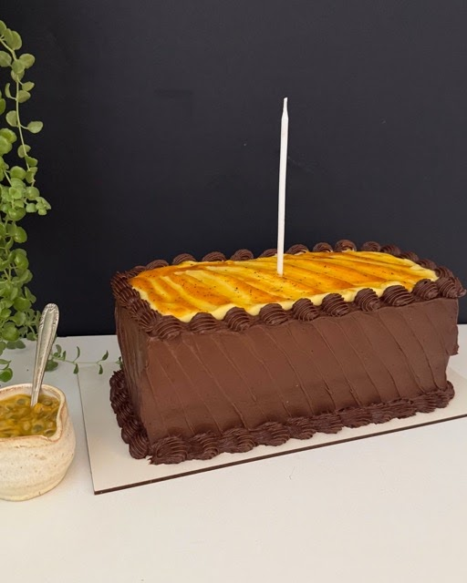
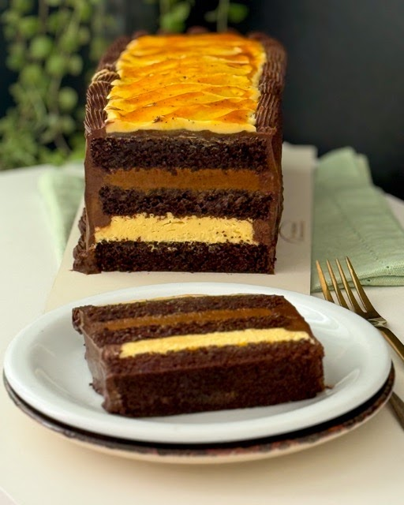

Lançamento, novo formato. Massa de cacau 100% com iogurte natural. Recheio de doce de leite caseiro da roça (cremoso) e ganache de maracujá. Cobertura de chocolate com doce de leite, creme de leite fresco e cacau. Decoração como na referência ou a critério da cliente.

**R$ 120,00 o kg.** O tamanho da foto tem aproximadamente 2,3 kg, rende de 15 a 18 fatias.

## Bolo Pudim

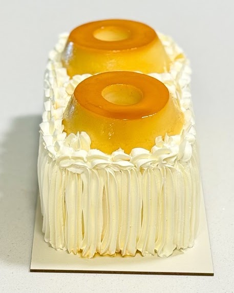
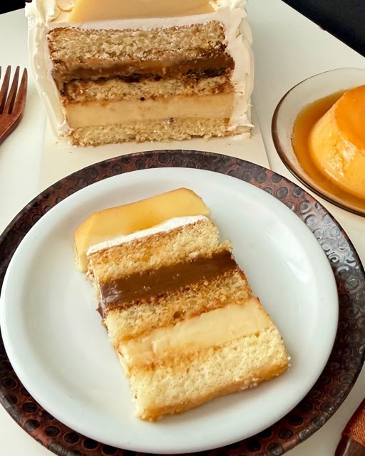

Long cake, massa amanteigada de baunilha. Recheio com uma camada de cocada cremosa com coco tostado e ameixa ou doce de leite, e outra camada de pudim. Cobertura de chantilly com creme de leite fresco. Decoração com pudim.

**R$ 120,00 o kg.** O tamanho da foto tem aproximadamente 2,6 kg, rende de 15 a 18 fatias.

## Bolo Snickers

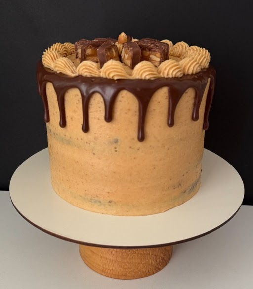
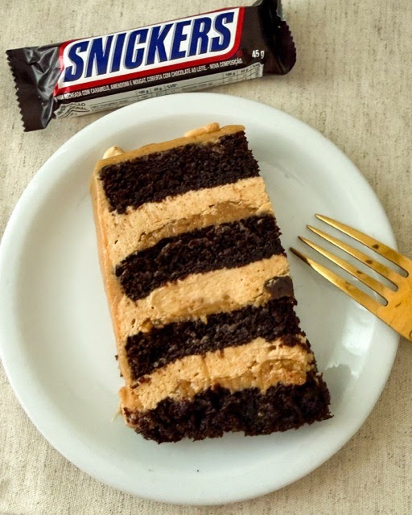

Massa de cacau 100% com iogurte natural e óleo de girassol. Recheio de cream cheese frosting com pasta de amendoim artesanal, caramelo salgado e amendoim. Cobertura igual ao recheio. Decoração como na referência ou a critério da cliente.

**R$ 120,00 o kg.**

## Red Velvet

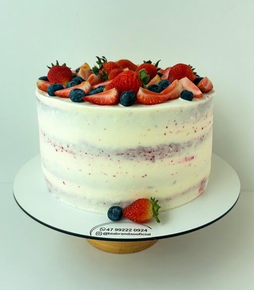
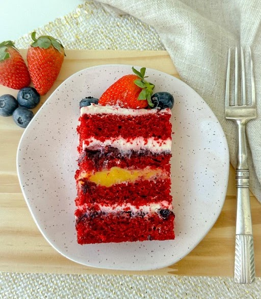

Massa amanteigada com sabor de chocolate e corante vermelho. Recheio de cream cheese frosting com redução de frutas vermelhas e lemon curd (creme de limão siciliano).

**R$ 115,00 o kg.**

## Red Velvet na taça

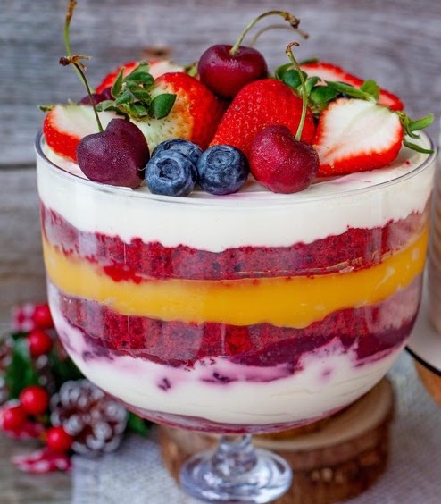

Camadas de massa amanteigada com sabor de chocolate e corante vermelho, creme de cream cheese frosting com redução de frutas vermelhas e curd de limão siciliano. Rende 8 porções.

**R$ 167,00 a unidade, com taça inclusa.**

## Marina

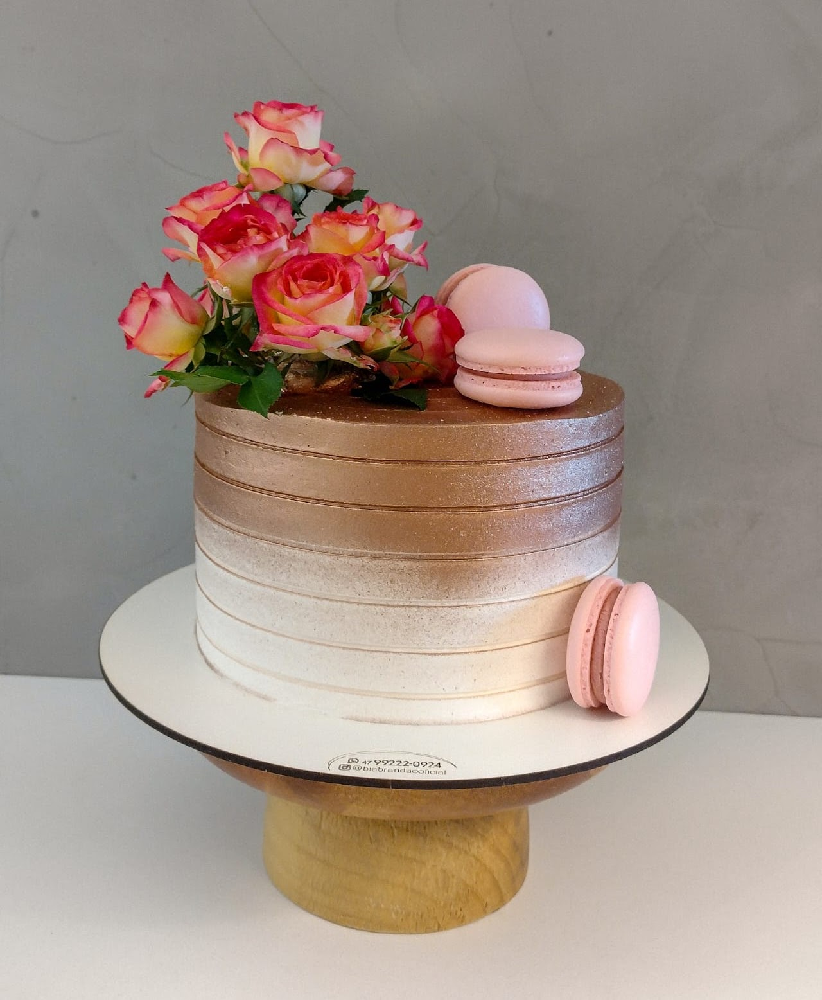
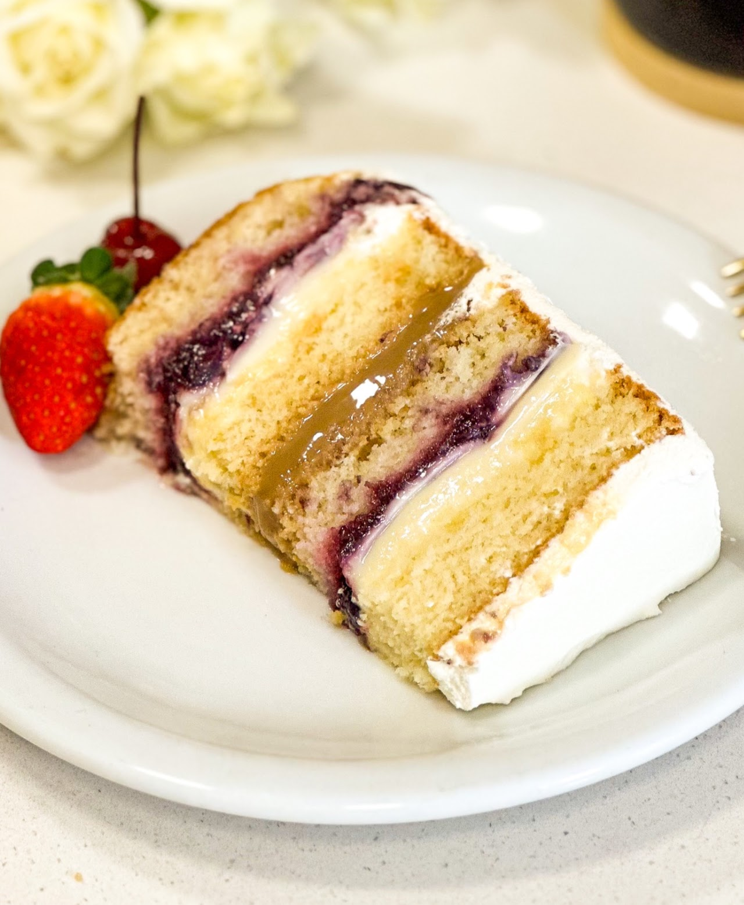

Massa amanteigada saborizada com extrato de baunilha. Recheio de creme 4 leites com redução de frutas vermelhas e doce de leite caseiro.

**R$ 115,00 o kg.**

## Torta Letícia

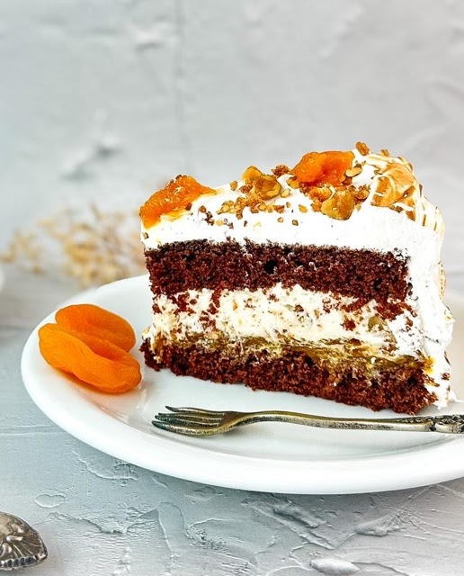

Pão de ló de chocolate. Recheio de damasco e cream cheese frosting com crocante de nozes. Cobertura de merengue suíço maçaricado, decorado com damascos e crocante de nozes.

**R$ 115,00 o kg.**

## Morango à lá Bia

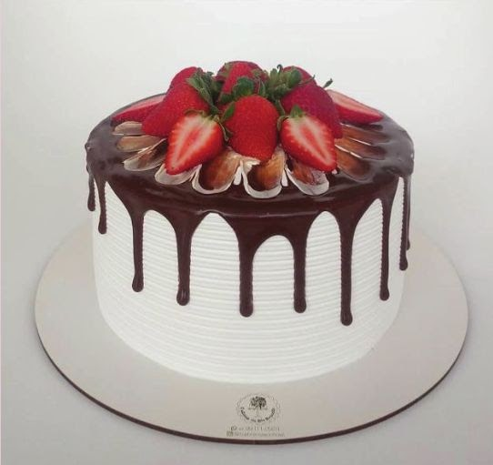
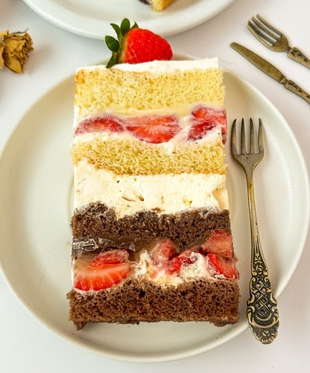

Pão de ló de baunilha e chocolate. Recheio de brigadeiro branco com morango, chantilly com suspiro e brigadeiro de chocolate com morangos. Cobertura de chantininho.

**R$ 115,00 o kg.** Quando o morango está fora de época há custo adicional; o valor depende do tamanho do bolo.

## Bolos com cobertura de buttercream

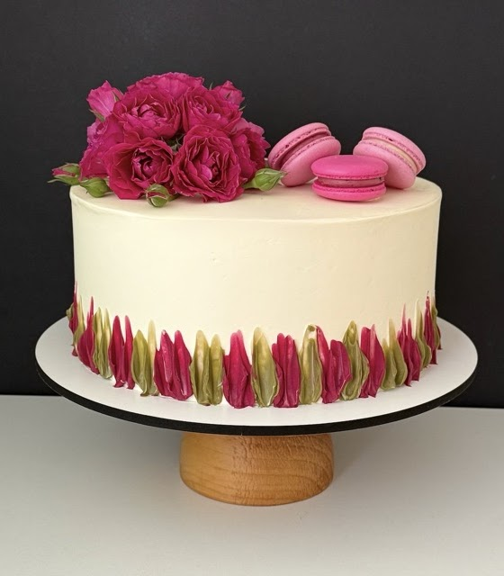

**R$ 125,00 o kg.**

## Bolo de chocolate com caramelo salgado e amendoim

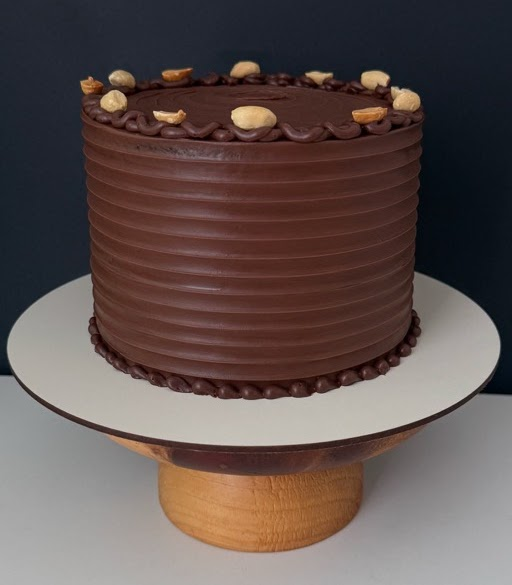
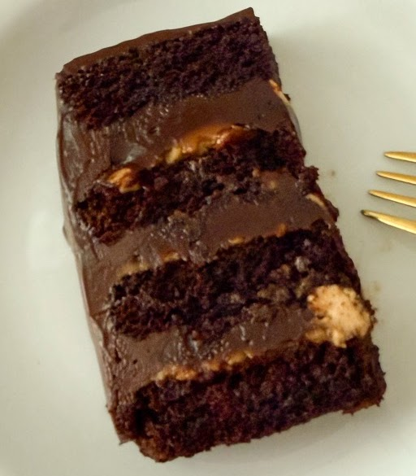

Recheio de ganache de chocolate meio amargo com caramelo salgado e amendoim. Massa de cacau 100%, iogurte natural e óleo de girassol. Três camadas de recheio e quatro de massa (pode acrescentar uma camada a mais). Cobertura de ganache meio amargo e amendoim.

**R$ 120,00 o kg.**

## Bolo de coco com abacaxi

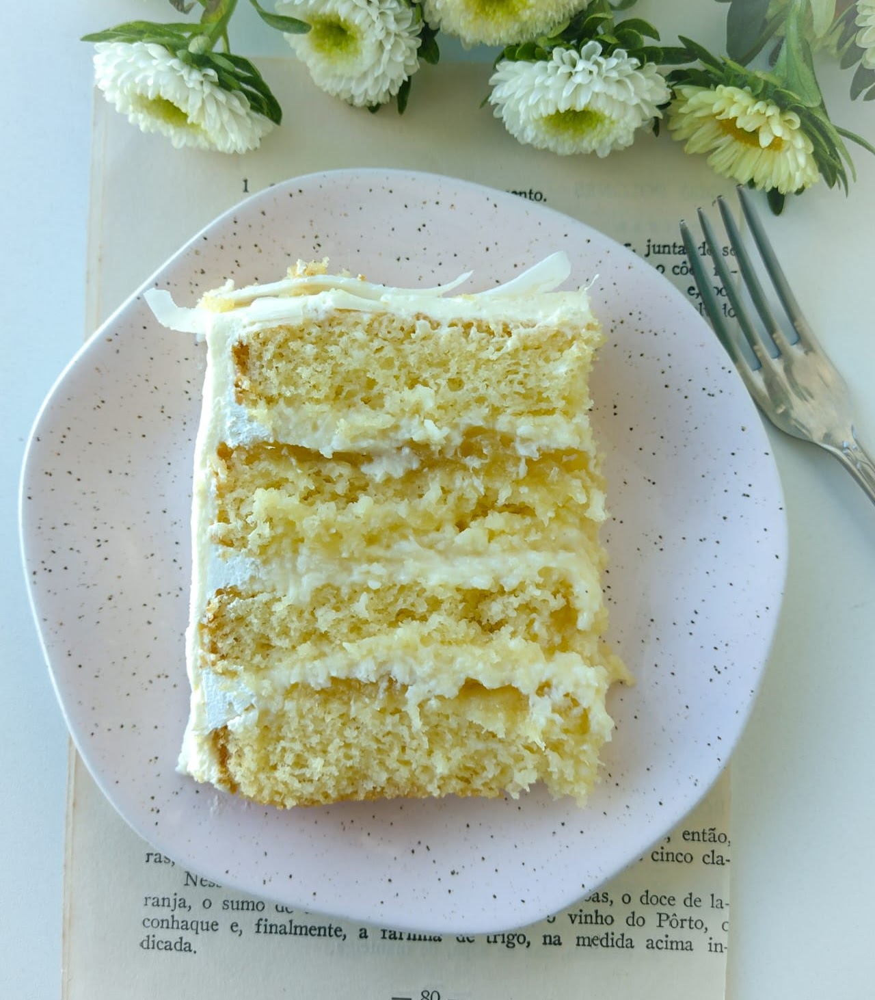

Massa amanteigada com coco. Recheio com duas camadas de cocada cremosa com abacaxi e uma camada de cocada. Cobertura de chantilly com creme de leite fresco (nata). Decoração a critério do cliente.

**R$ 115,00 o kg.**

## Pistache com frutas vermelhas

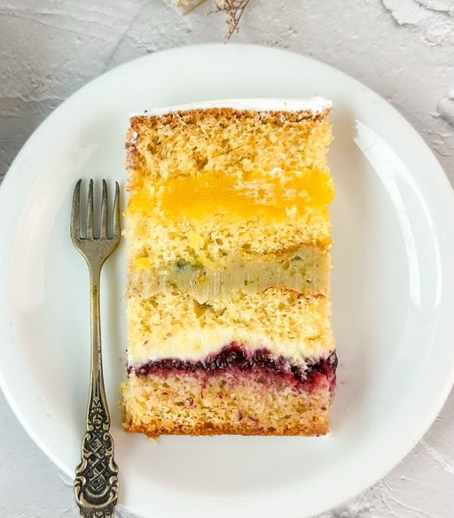

Massa amanteigada. Recheio de baba de moça, brigadeiro de pistache e creme 4 leites com redução de frutas vermelhas (o brigadeiro pode virar ganache de pistache). Decoração a critério do cliente.

**R$ 115,00 o kg**, com adicional do recheio de pistache a partir de R$ 18,00 dependendo do tamanho.

# Nossas massas

Pão de ló de baunilha, pão de ló de chocolate, chocolate com iogurte, amanteigada, red velvet. Podem ser saborizadas com pasta de baunilha, limão siciliano e mirtilo.

# Recheios

4 leites, baba de moça, doce de leite, prestígio, damasco, strogonoff de nozes, morango, baunilha, redução de frutas vermelhas, brigadeiro branco, brigadeiro de chocolate. Ganache de chocolate meio amargo ou branco, ganache de limão siciliano e brigadeiro de pistache têm taxa adicional. Sabor personalizado a critério do cliente.

**R$ 115,00 o kg.**

# Sem lactose

**R$ 118,00 o kg.** Livre de lactose para intolerantes. Pode haver contaminação cruzada, portanto não indicado para celíacos.

Massas: baunilha, chocolate. Recheios: brigadeiro branco, brigadeiro de chocolate, brigadeiro de pistache (taxa adicional), damasco, ameixa, morango, baba de moça, doce de leite, strogonoff de nozes, prestígio. Cobertura: merengue suíço, pode ser maçaricado.

# Adicionais

Cobrados à parte, consultar no orçamento. Flores naturais (a partir de R$ 22), frutas vermelhas (a partir de R$ 35), recheio com pistache (a partir de R$ 18 por camada). Topo em scrapbook, terceirizado, por tamanho: 15 cm R$ 18, 17 cm R$ 20, 20 cm R$ 25, 23 cm R$ 35, 25 cm R$ 40. Cobertura em cores que exigem corante extra a partir de R$ 10 a R$ 12. Decoração com macarons R$ 8 a unidade. Glitter e pó decorativo, 5 g por R$ 16. Taxa de decoração a partir de R$ 12.

# Tamanhos e rendimentos

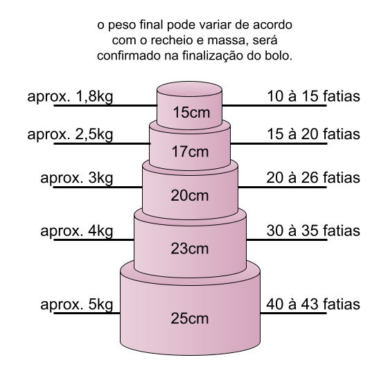

Bolos com massa amanteigada pesam mais. Recheio e decoração influenciam no peso final.

# Informações gerais

**Pedidos:** WhatsApp (47) 99222-0924, com 3 dias de antecedência e sujeitos à disponibilidade.

**Pagamento:** 50% adiantado na confirmação, restante até a retirada. PIX, dinheiro e transferência. Não trabalhamos com cartão.

**Entregas:** via entregador ficam a cargo do cliente. Combinar horário de retirada. Encomendas para domingo, retirar aos sábados até as 14h.

## Validade e armazenamento

5 dias sob refrigeração, embalado corretamente. Bolos com frutas frescas: 2 dias. Bolo transportado deve ir ao refrigerador ao menos 30 minutos antes de ir para a mesa. Bolos em exposição devem ficar em ambiente fresco, de preferência com ar-condicionado. Transportar em superfície reta; em automóvel, pode ir no chão, na caixa.

<a class="whats" href="https://wa.me/5547992220924">Fazer pedido pelo WhatsApp</a>